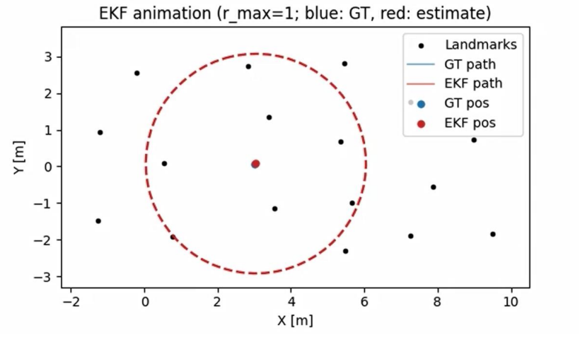
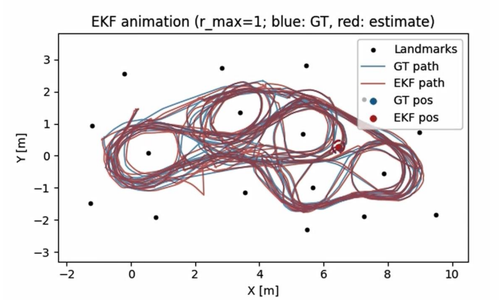

# EKF Localization with Range-Bearing Landmarks

This repository implements a 2D robot localization pipeline using an Extended Kalman Filter (EKF) with odometry and range-bearing landmark measurements.

## Overview
The robot is modeled with a unicycle motion model, and landmark observations are represented by range and bearing measurements with a forward sensor offset. The estimator fuses noisy odometry and exteroceptive measurements to estimate the robot pose over time.

This project includes experiments with different sensing ranges, poor initialization, and a Joseph-form covariance update for improved numerical stability.

## Method
The implementation contains:
- A unicycle motion model with Euler discretization
- EKF prediction and correction steps
- Range-bearing landmark observation model with sensor offset
- Angle wrapping for heading and bearing residuals
- Block measurement updates for multiple landmarks observed at the same timestep
- Joseph-form covariance update for better numerical robustness

## Experiments
The script supports several experiment settings:
- Different landmark sensing ranges: `r_max = 5, 3, 1`
- Standard initialization and poor initialization
- A reference run using ground-truth linearization for comparison
- Trajectory animation with covariance ellipse visualization

## Figures

### EKF Animation: Initialization


### EKF Animation: Estimated and Ground-Truth Trajectories


## Files
- `ekf_joseph.py`: main EKF implementation
- `requirements.txt`: Python dependencies
- `.gitignore`: excludes datasets, generated figures, and cache files

## Requirements
Install dependencies with:

```bash
pip install -r requirements.txt
```

## How to Run
This script requires the dataset file `dataset2.mat`, which is not included in this repository.
After preparing the dataset and updating the dataset path inside the script, run:

```bash
python ekf_joseph.py
```

## Notes
This repository is adapted from a graduate state estimation course project at the University of Toronto.
The public version keeps the Joseph-form covariance update because it is more numerically stable than the standard covariance update used in the original assignment write-up.
The dataset and original course handout are not included in this repository.
